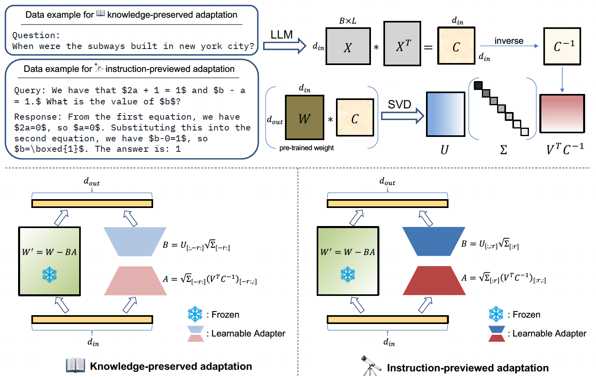

# CorDA: Context-Oriented Decomposition Adaptation of Large Language Models

**(under construction)**

Authors: [Yibo Yang](https://iboing.github.io/), Xiaojie Li, Zhongzhu Zhou, Shuaiwen Leon Song, [Jianlong Wu](https://jlwu1992.github.io/), [Liqiang Nie](https://liqiangnie.github.io/index.html), [Bernard Ghanem](http://www.bernardghanem.com/)

Paper: [[PDF](https://arxiv.org/pdf/2406.05223)]



---


## Getting Start

Download the repo and install dependencies. 

```
git clone https://github.com/iboing/CorDA.git
cd CorDA
pip install -r requirements.txt
```

The dataset in json formats used to collect covariance matrices can be downloaded from our huggingface repo. The other datasets will be automatically downloaded when runing the code. 

## Step 1: Context-oriented Decomposition

Corda enables to initialize a learnable adapter in two modes, knowledge-preserved adaptation (`tools/build_KPA.sh`) and instruction-previewed adaptation (`tools/build_IPA.sh`). The knowledge-preserved adaptation samples questions from QA datasets, such as `triviaQA` and `nq_open`, to obtain covariance matrices for decomposition, and uses the smallest $r$ singular values and vectors to initialize the adapter. The instruction-previewed adaptation samples queries and responses from the finetuning dataset to obtain covariance matrices, and initialize the adapter with the larget $r$ singular values and vectors. 

### 📖 Knowledge-preserved adaptation

```bash
CUDA_VISIBLE_DEVICES=0 python build_corda.py \
    --model_id "meta-llama/Llama-2-7b-hf" \
    --cov_aware \
    --r [rank] \
    --use_cache \
    --calib_dataset "nqopen" \
    --calib_loader_size 256 \
    --save_model \
    --save_path [path_to_initialized_model] \
```

Arguments:

- `--model_id` is the pre-trained model for decomposition.
- `--cov_aware` adopts our context-oriented decomposition and collects covariance matrices.
- `--r` is the low rank of LoRA.
- `--use_cache` adopts the dataloader and covariance matrices saved in `CorDA/cache`, to avoid calculating the covariance matrices again.
- `--calib_dataset` specifies the dataset to sample data to obtain covariance matrices. KPA mode uses QA datasets with choices of `"nqopen"` and `traivia_qa`.
- `--calib_loader_size` is the number of sampled data. 
- `--save_model` saves the initialized model in `--save_path`. 

### 🔭 Instruction-previewed adaptation

```bash
CUDA_VISIBLE_DEVICES=0 python build_corda.py \
    --model_id "meta-llama/Llama-2-7b-hf" \
    --cov_aware \
    --r [rank] \
    --use_cache \
    --first_eigen \
    --calib_dataset "MetaMATH" \
    --calib_loader_size 256 \
    --save_model \
    --save_path [path_to_initialized_model] \
```

Arguments:

- `--first_eigen` uses the largest $r$ singular values and vectors to initialize the learnable adapter for the instruction-previewed adaptation mode. 
- `--calib_dataset` specifies the dataset to sample data to obtain covariance matrices. IPA mode uses finetuning datasets with choices of `"MetaMATH"`, `"codefeedback"`, `"WizLMinstruct"`, and `"alpaca"`.

## Step 2: Adapter Training


## Step 3: Inference